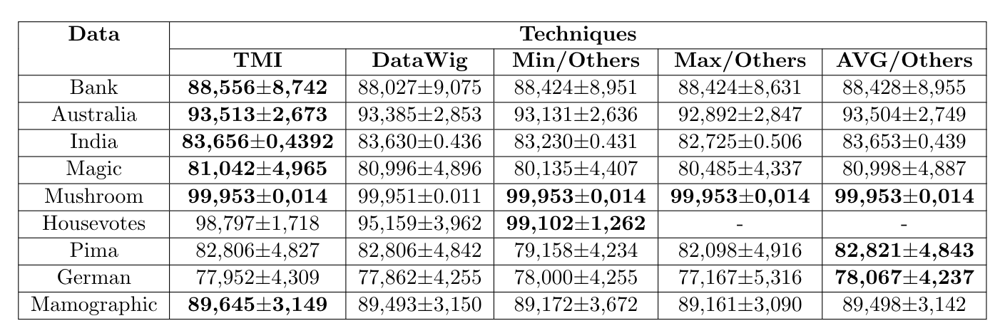
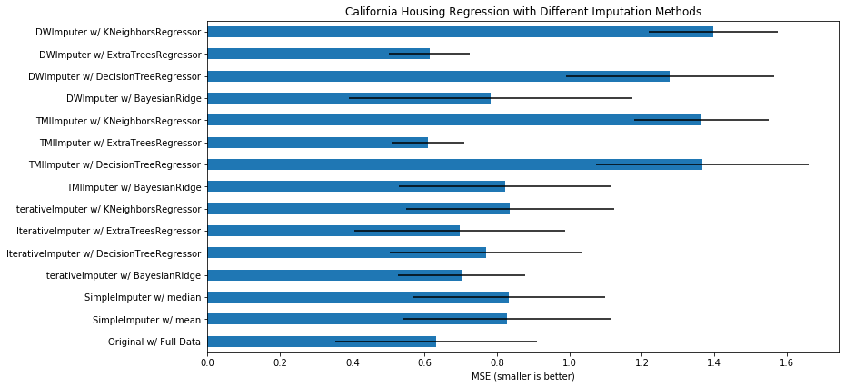

# Tree Missing Imput: A new approach to filling in missing values.

### Abstract
Nowadays the area of artificial intelligence more specifically in machine learning has been widely applied in this era of digitization of today's companies, from the sectors with simple tasks to complex tasks as predicts which of their clients is a possible fraudster, in all areas. Professionals machine learning has been bringing very significant results, but few people know that to apply machine learning techniques in your business environment you must first understand your data well, for this there is the area of data mining, Where there are various techniques for applying data refinement, creating new features, and among other important steps before we get into the model development process, this step is vital to having the desired model perform well without a good mining application. data you will not have an unstable and poor performance model. In the data mining area there is a very common problem that appears in almost every segment in the machine learning area like supervised, unsupervised and semi-supervised which is missing data in your database and this is quite critical Depending on the volume and which variable it is in, to solve this problem there are several techniques from the simplest to the most complex, and we will present some of them later. Our approach addresses exactly this problem that is so vital in most database preprocessing developments, where this solution uses a decision tree to predict the missing values ​​for each variable in the data, but the process of splits and evolution of that tree has a different approach than classic trees like CART and ID3, all development of this project will be done in Python.

### Tree Missing Imput

The Tree Missing Imput (TMI) approach was developed because of the need to improve the performance of database learning models that have missing data, currently many developers use missing padding on numeric variables such as minimum, maximum, quantile (10%, 15%,...,90%), median, average and others to replace this missing data, but these approaches do not bring significant performance improvements either individually or together for the models, and with this type of padding is generated a category within a numerical variable depending on the volume of missing, for the categorical variables a lot is used to fill the category with larger, smaller volume, or a new category that is also another not very sophisticated approach, for comparison we will use database of binary classification extracted from the Keel website (https://sci2s.ugr.es/keel/missing.php) and we will use the DataWig technique (https://datawig.readthedocs.io/en/latest/) where this technique applies neural networks to estimate missing values, the scikitlearn IterativeImputer (https://scikit-learn.org/stable/modules/impute.html) and also the traditional techniques mentioned above.

My goal was to bring a new approach of simple use, with good performance and fast processing, so I thought of bringing decision tree approach in a different way, this approach will be presented in topics:

<ol>
<li>First we apply a preprocessing to the data, for numerical variables we transform into categorical variables with ranges determined by the 10% quantiles and if we have missing in it we generate a class 'MISSING' and for categorical variables we apply only the class 'MISSING' if there is missing in itself.</li>
<li>Next we compute the information gain of these new variables in relation to the missing variable, for example: The gender variable has 15% of missing and then the information gain in the complementary variables is computed and ordered from highest to lowest. and this applies to each missing variable of the data.</li>
<li>As the tree growth order is applied to the tree pruning, our tree stopping criterion is when the current node has only missing record and that this amount is greater than or equal to 9% of the missing amount of the variable, With this we stop the growth of the tree, done this step is applied pruning of nodes with low registration frequency with fill, we remove nodes with frequency below 30.</li>
<li>For the missing records in the categorical variables that are not in any tree node we apply a new category 'others' and for the numerical variables we apply the mean of the variable itself.</li>
</ol>

This generates a tree for each missing variable in the data, so in the end we will have a new data with its filled variables. The numbers 9% and 30 of the pruning parameters were obtained from simulations, so I will leave these values fixed.

### Results

In this topic I used the UCI database that was Bank and the rest of Keel, the classifier used to measure the performance of the approaches was LDA (Linear Discriminant Analysis), all bases have binary taregt and with that I applied the technique of AUC to measure performance, in both databases I used size 10 k-fold to calculate the average and deviation of performance of each study approach, it is worth remembering that all these approaches are applied to any kind of problem since supervised and unsupervised.

In Table 1 shows the results obtained, in the columns containing 'others', I applied a new class in the categorical variables called 'others', and for the numerical variables were applied the minimum, maximum and average, TMI and DataWig.

Figure 1 illustrates the extracted result based on the experiment found in scitkitlearn (https://scikit-learn.org/stable/auto_examples/impute/plot_iterative_imputer_variants_comparison.html) in this experiment and applied to a regression problem which is a different approach. TMI and DataWig were added for comparison, in the barplot shows the TMI with ExtraTreesRegressor showing the best performance with the value of 0.608938 and DataWig with 0.613505, where both presented a result below with the original data. which was 0.631302, another important detail is the variation of the result by folds, where the TMI showed a smaller variation than DataWig with the ExtraTreesRegressor technique.

From the results obtained, we have a good performance in the study bases losing only three, so we can argue that this approach presents a substantial gain compared to the proposed techniques, another gain detail and the learning processing time compared to DataWig, in the Australian base for example TMI presented 8s of response and while DataWig presented 85s, with this we have a gain of 10 times more and this varies according to the amount of epochs defined by the user.
At the Mushroom base where it already has a high predictive power we are able to leverage performance by jumping to maximum performance. Base Housevotes all its variables are categorical and binary and with high sensitivity and so much so that DataWig had a very significant performance drop, our approach showed better performance stability between fold results.

### Algorithm usage
Parameters of imput of function IMV
<ol>
<li>data: Input data for training</li>
<li>target: Name of target variable to remove from training to avoid overfiting problem.</li>
<li>save_model: Boolean to save or not save each generate model, all the saves will be in the format .npy.</li>
</ol>

Parameters of imput of function predict

<ol>
<li>new_dt: Input new data for predict of missing values.</li>
<li>new_weights: Weigths generate by model.</li>
<li>new_pre_processing: Preprocessing generate by model.</li>
</ol>

